# 项目架构图和流程图

## 系统架构图

### 整体架构

### 双系统架构

## ECS架构图

### ECS核心架构

### 组件关系图

```mermaid
graph LR
    subgraph "ECS核心"
        E[Entity<br/>实体]
        C[Component<br/>组件]
        S[System<br/>系统]
    end
    
    subgraph "实体示例"
        P[Player<br/>玩家]
        EN[Enemy<br/>敌人]
    end
    
    subgraph "组件示例"
        POS[Position<br/>位置]
        H[Health<br/>生命值]
        SK[Skill<br/>技能]
    end
    
    subgraph "系统示例"
        MS[Movement<br/>移动]
        CS[Combat<br/>战斗]
        SS[Skill<br/>技能]
    end
    
    E --> P
    E --> EN
    
    C --> POS
    C --> H
    C --> SK
    
    S --> MS
    S --> CS
    S --> SS
    
    P --> POS
    P --> H
    P --> SK
    
    EN --> POS
    EN --> H
    
    MS --> POS
    CS --> H
    SS --> SK
```

## 数据流图

### 抽卡系统数据流

### ECS系统数据流

### 模板驱动数据流

## 时序图

### 抽卡流程时序图

### ECS系统时序图

## ER图

### 抽卡系统ER图

### ECS系统ER图

## 组件图

### 系统组件关系

### ECS组件关系

## 部署架构图

### 当前部署架构

### 未来部署架构

## 状态图

### 抽卡系统状态图

### ECS系统状态图

## 类图

### 核心类关系
